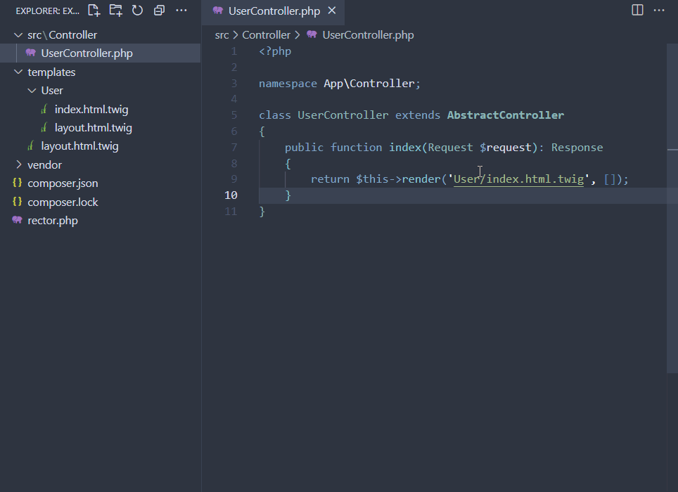
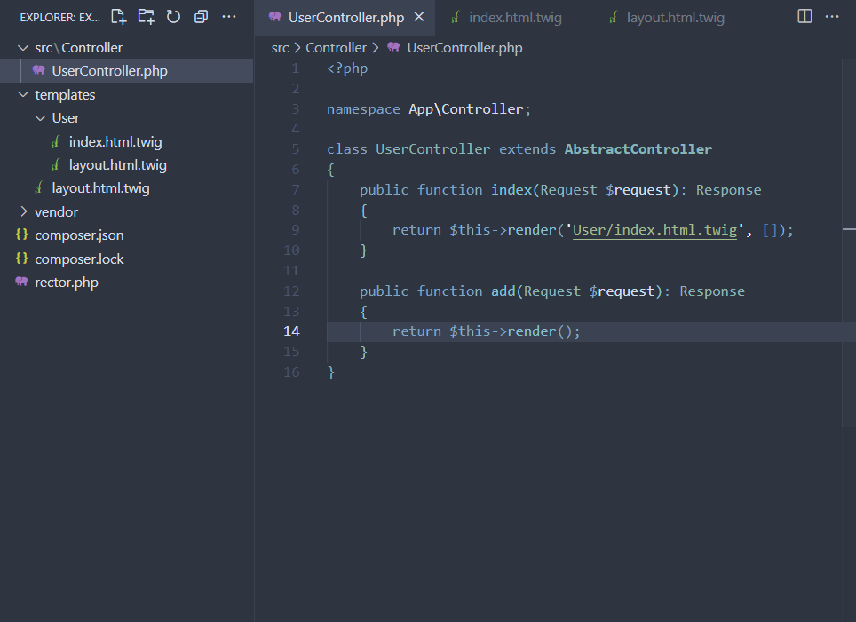

# Twig link resolver

This extension allows you to quickly open your twig file by clicking the links generated in your editor.

It **does not** (yet) support multiple root folders to resolve your twig files.

 
 

## Configuration
Prepend the keys with the extension name : **twigLinkResolver** (e.g. `twigLinkResolver.templatesRootFolder`)

 
<table>
    <thead>
        <tr>
            <th>
                Key
            </th>
            <th>
                Description
            </th>
            <th>
                Default
            </th>
            <th>
                Possible values
            </th>
        </tr>
    </thead>
    <tbody>
        <tr>
            <td>
                <b>templatesRootPath</b>
            </td>
            <td>
                The relative path to your twig templates folder
            </td>
            <td>
                "templates"
            </td>
            <td>
                any
            </td>
        </tr>
        <tr>
            <td>
                <b>languageFilter</b>
            </td>
            <td>
                What languages are supported for the generated links
            </td>
            <td>
                [ 
                    "php", 
                    "html", 
                    "twig" 
                ]
                 
                <i>To enable the generation in twig files you must enable the filters "html" and "twig"</i>
            </td>
            <td>
                All existing language ids supported by Vscode
            </td>
        </tr>
    </tbody>
</table>

 
 

## Demo

 

### Navigating files

 
 

### Creating file
